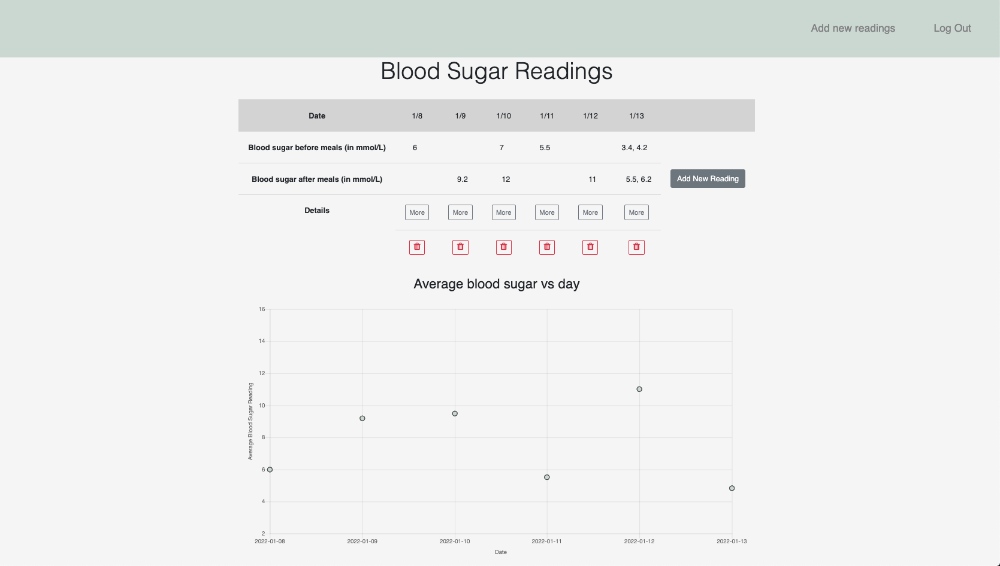
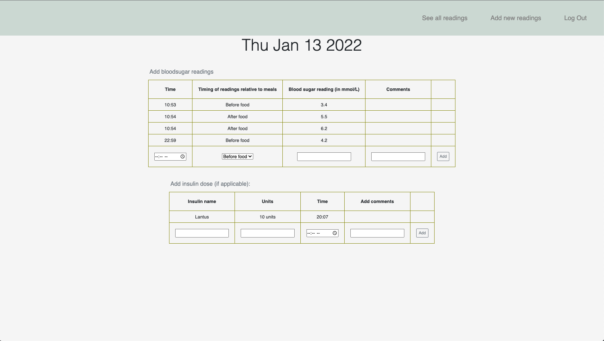

# Blood Sugar Tracker

This project is used to input blood sugar levels for those with diabetes. The application allows the user to input blood sugar by date, and charts the data for easy comparison  

--

* The login page used Google OAuth to login to see the user’s personalized blood sugar data

* Once the user logs in, they will see their blood sugar readings, as well graphs average blood sugar readings to the data. 

* In the show page, user can additionally add any additional blood sugar readings, as well as any  insulin doses can be added.  

* Main site can be found [here ](https://sei-bloodsugartracker.herokuapp.com/)

--
Technologies used:

* Nodejs
* Express
* Mongoose
* MongoDB
* Chartjs

