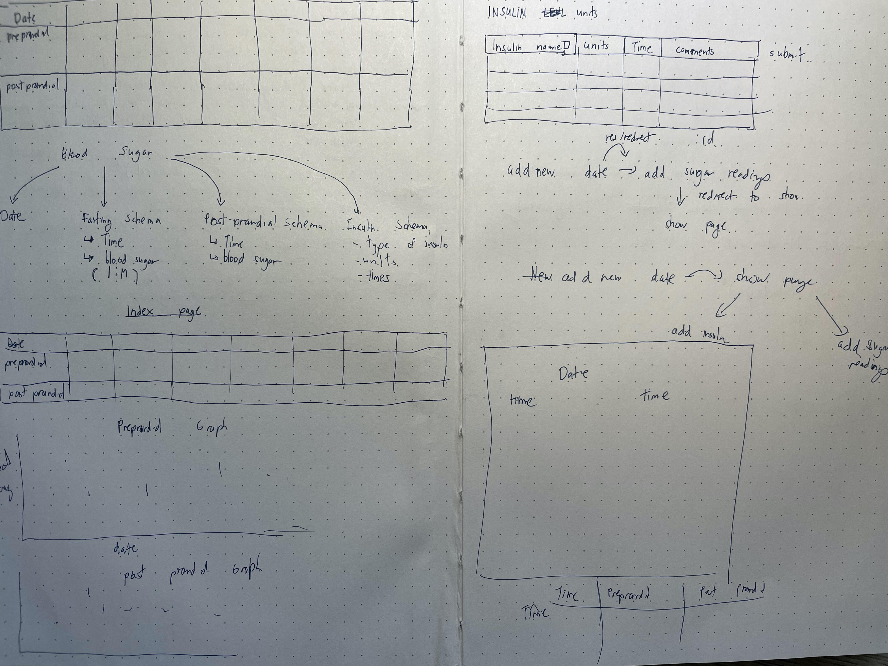

# Blood Sugar Tracker

This project is used to input blood sugar levels for those with diabetes. The application allows the user to input blood sugar by date, and charts the data for easy comparison. The application uses mongoose modeling to compile its data, including embedded data for blood sugar readings and insulin. 

<!-- Wireframing of the project can be below:

 -->
---

* The login page used Google OAuth to login to see the user’s personalized blood sugar data

* Once the user logs in, they will see their blood sugar readings, as well graphs charting average blood sugar readings to the data. 

* In the page for each day, user can additionally add any additional blood sugar readings, as well as any  insulin doses can be added.  

* Main site can be found [here ](https://sei-bloodsugartracker.herokuapp.com/)

---
Technologies used:

* Nodejs
* Express
* Mongoose
* MongoDB
* Chartjs

Next Steps: 

* Add additional CRUD functionality, including delete and update functions of insulin readings and blood sugar readings
* Add doctor/patient functionality and authorization

